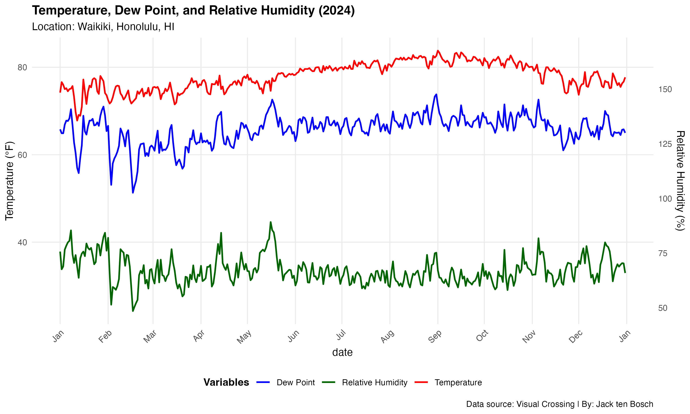
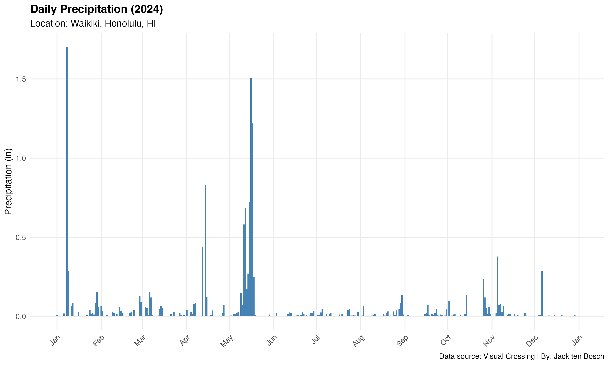
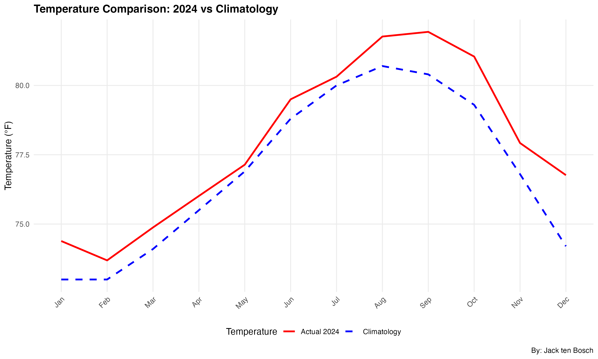
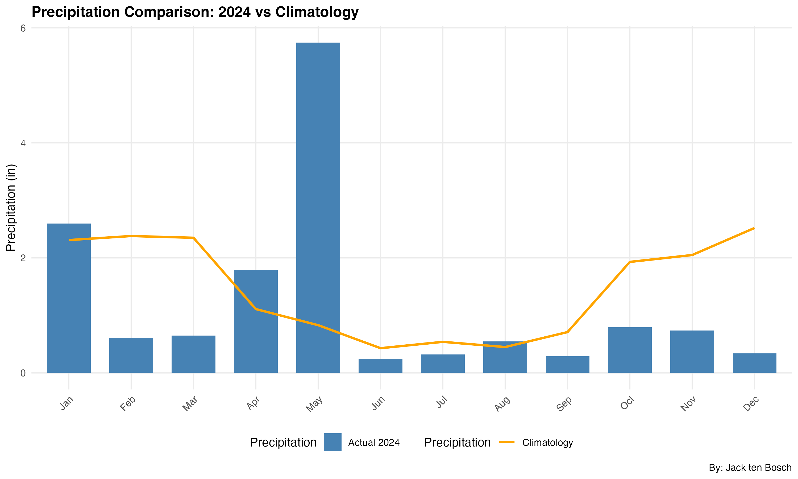
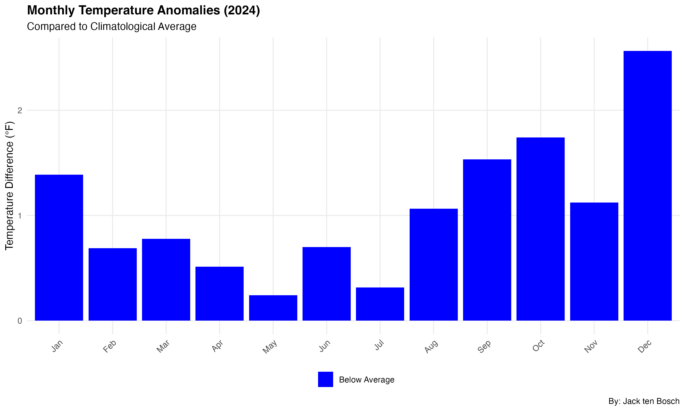
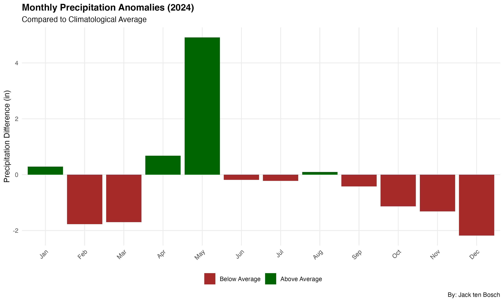

# ERTH 162 - Spring 2025 - Project #1: Data Collection

This repository contains the code and data for Project #1 of ERTH 162

## Project Overview

The primary goal of this project is to analyze weather data for Waikiki, Honolulu, HI, using the `data.csv` dataset.

## Files

*   `main.R`: The main R script that performs data loading, preprocessing, analysis, and visualization.
*   `data.csv`: The raw weather data used for the analysis.
*   `plots/`: Directory containing the generated plots.

## Analysis

The `main.R` script does the following:

1.  Loads and preprocesses the weather data.
2.  Generates time series plots for temperature, dew point, relative humidity, and precipitation.
3.  Calculates monthly summaries of weather variables.
4.  Compares the 2024 data with historical climatology data for Honolulu.
5.  Generates anomaly plots for temperature and precipitation.
6.  Calculates and prints key weather statistics for the period.

## Usage

To run the analysis, execute the `main.R` script in an R environment with the required libraries installed (`ggplot2`, `dplyr`, `lubridate`, `zoo`, `patchwork`, `scales`). Ensure the `data.csv` file is in the same directory. 

## Generated Plots

Below are the visualizations generated by the analysis script:

**1. Time Series: Temperature, Dew Point, and Relative Humidity**

**2. Time Series: Daily Precipitation**

**3. Comparison: Monthly Temperature (2024 vs Climatology)**

**4. Comparison: Monthly Precipitation (2024 vs Climatology)**

**5. Anomalies: Monthly Temperature**

**6. Anomalies: Monthly Precipitation**
 
